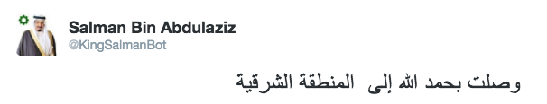
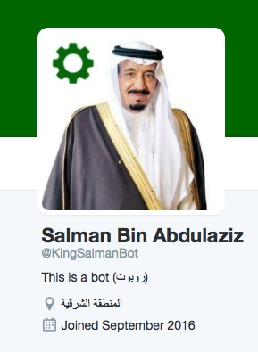
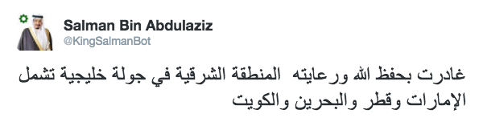
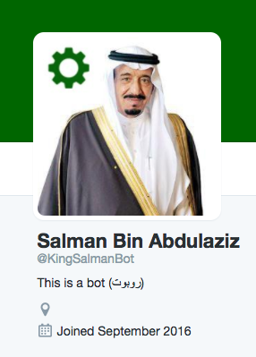
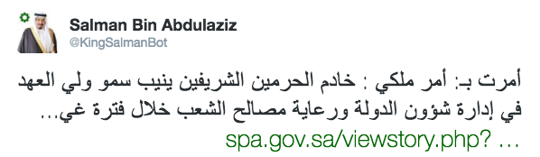
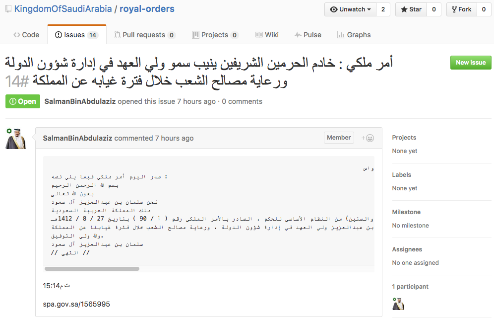
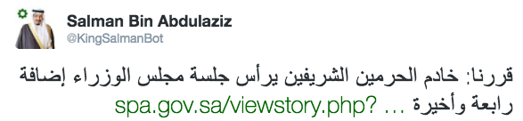
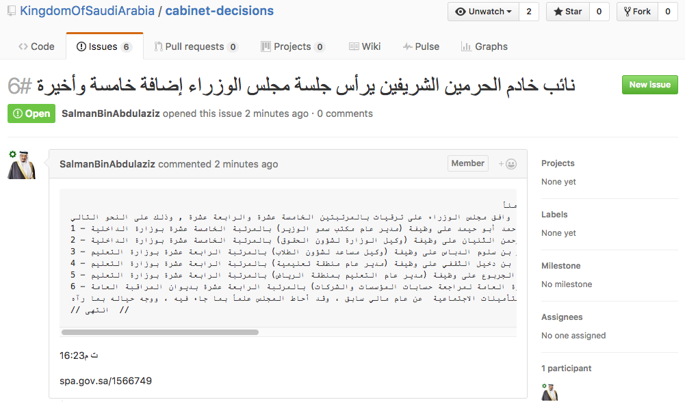
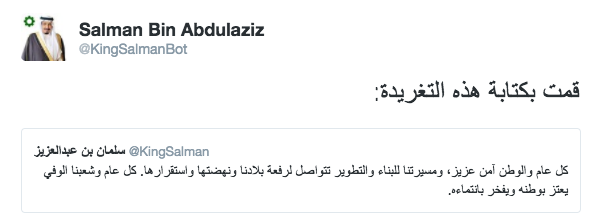

# SaudiBots
Collection of bots related to the Kingdom of Saudi Arabia

##About
The idea of this project is to create bots interact with news, events and activities related to Saudi Arabia. Currently the project has only one bot "kingbot".

##How it works
The bots are hosted on DigitalOcean Droplet (Ubuntu 16.04.1 x64) and running every 15 min by a Cron job.

##Bot: kingbot
The bot performs actions based on news related to the King of Saudi Arabia provided by the Saudi Press Agency (SPA) and it will check the following:

###1: King's arrial news
It will check if there is any new news related to the King arrival to a certain place, based on last "arriavl_id" stored on the bot's configuration file. Then the bot will tweet about it and update the profile location for the account "KingSalmanBot".

 

###2: King's leave news
Similar to the arrival news the bot will tweet and remove the location from the the profile.

 

###3: Royal Orders
The bot will check if there is any new royal orders based on the last "order_id" stored in the bot's configuration file. Then the bot will tweet the order in KingSalmanBot and create a ticket in the "royal-orders" GitHub's repo.

 

###4: Cabinet Decisions
Similar to the royal orders, the bot will check based on last "order_id" stored in the bot's configuration file. Then will tweet and create a ticket in "cabinet-decisions".

 

###5: King's tweets
The bot will check if "KingSalman" tweeted based on last "retweet_id" stored in the bot's configuration file. Then retweet it in "KingSalmanBot".

##ToDo (upcoming bots)

...

##Credit

Gear icon from "[ICONFINDER](https://www.iconfinder.com/)".